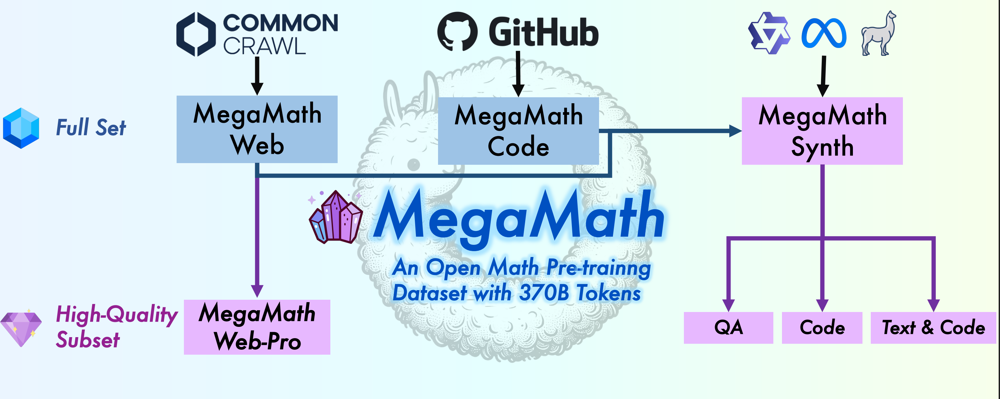

<div align="center">
<h1>  MegaMath: An Open Math Pre-trainng Dataset with 370B Tokens.</h1>

[](https://huggingface.co/datasets/LLM360/MegaMath)
[](https://arxiv.org/pdf/2504.xxxxx)
</div>

## About MegaMath

<div align="center">

</div>

MegaMath is a large-scale pre-training dataset for math.
It is curated via the following three efforts:

- **Revisiting web data**: We re-extracted mathematical documents from Common Crawl with math-oriented HTML optimizations, fasttext-based filtering and deduplication, all for acquiring higher-quality data on the Internet.
- **Recalling Math-related code data**: We identified high quality math-related code from large code training corpus, Stack-V2, further enhancing data diversity.
- **Exploring Synthetic data**: We synthesized QA-style text, math-related code, and interleaved text-code blocks from web data or code data.

## How to Use

MegaMath includes many different data variants which is tailored for different training demands.

If you are training your LLM from scratch, we recommend you to use the full set of our web data.
```python
from huggingface_hub import snapshot_download
snapshot_download(
    repo_id="LLM360/MegaMath",
    local_dir="./",
    repo_type="dataset",
    allow_patterns=["megamath-web/*"]
)
```

If you are performing continual pre-training from strong base models, **MegaMath-Web-Pro** may be your best choice.
```python
from huggingface_hub import snapshot_download
snapshot_download(
    repo_id="LLM360/MegaMath",
    local_dir="./",
    repo_type="dataset",
    allow_patterns=["megamath-web-pro/*"]
)
```

We also provide **MegaMath-Code** which can enhance the performance of your LLM on solving math-related tasks via Python code. Moreover, MegaMath contains over 80B tokens of synthetic data, which can be used to further enhance the performance of your LLM on solving math-related tasks.

```python
from huggingface_hub import snapshot_download
snapshot_download(
    repo_id="LLM360/MegaMath",
    local_dir="./",
    repo_type="dataset",
    allow_patterns=[
        "megamath-qa/*", 
        "megamath-translated-code/*", 
        "megamath-text-code-block/*",
        "megamath-code/*"
    ]
)
```

## Data Pipeline

Please refer to the [web_pipeline](./web_pipeline) for more details. We are actively working on the code pipeline and will update the README soon.


## Citation
If you use our dataset or find our work useful, please cite
```bibtex
@article{zhou2025megamath,
  title     = {MegaMath: Pushing the Limits of Open Math Corpora},
  author    = {Zhou, Fan and Wang, Zengzhi and Ranjan, Nikhil and Cheng, Zhoujun and Tang, Liping and He, Guowei and Liu, Zhengzhong and Xing, Eric P.},
  journal   = {arXiv preprint arXiv:2504.xxxxx},
  year      = {2025},
  note      = {Preprint}
}
```